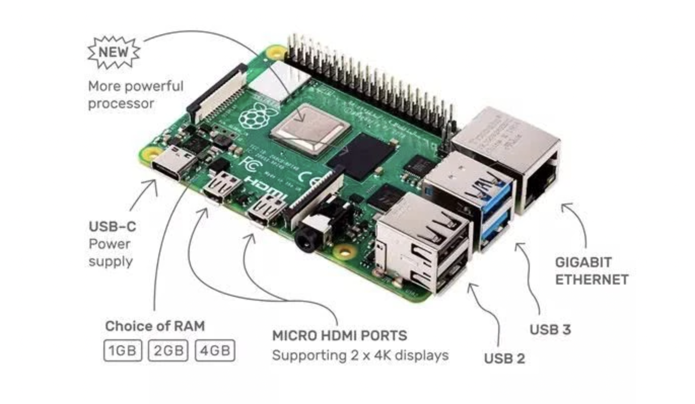

# 00: 准备工作

因为国内的环境，需要对原来的 Dockerfile 和 命令做一些更改。

## 更改 Dockerfile

打开 `docker/rustembedded-osdev-utils/Dockerfile`，找到`# QEMU`，更改 `git` 地址为下面这行：

```
# QEMU
git clone https://git.qemu.org/git/qemu.git;    
```

## 更改 Makefile 中 Docker 命令

`docker build` 命令下要添加这一行：

```
  --add-host raw.githubusercontent.com:185.199.111.133 \
```

这是为了避免无法解析 `raw.githubusercontent.com` 域名而为，IP地址如果不行，则请自行`ping`获取最新的。

## 构建本地 Docker 镜像

进入 `docker` 目录，执行命令：

```
> make
```

即可。

## 教程说明

包含一个独立可引导的二进制内核文件。前五章只能使用 Qemu 来运行，因为都是基础内容。到了第六章可以在树莓派上加载和运行内核并通过UART来观察输出结果。

### 代码组织和结构

- `src/_arch`。针对特定目标架构的内核子系统，放到该目录下。`_arch`中的`_`表示此文件夹不属于标准模块层次结构。而是使用`＃[path ="_arch/xxx/yyy.rs"]`属性将其内容有条件地引入各自的文件中。

- `bsp/`。 bsp 模块中定义 `BSP`， 表示 Board Support Package。而且包含目标主板特殊的定义和功能。这些是诸如主板的内存映射或相应主板上的设备驱动程序实例之类的东西。

### 内核接口

`arch`和`bsp`都包含根据实际目标和主板不同而编译的代码。例如，`interrupt controller`对于硬件`Raspberry Pi 3`和`Raspberry Pi 4`是不同的，但是我们想让`kernel`剩下的代码可以轻松地适配它们。

通过 trait 接口来对其进行抽象是个很好的做法。

```text
        +-------------------+
        | Interface (Trait) |
        |                   |
        +--+-------------+--+
           ^             ^
           |             |
           |             |
+----------+--+       +--+----------+
| kernel code |       |  bsp code   |
|             |       |  arch code  |
+-------------+       +-------------+
```

## 嵌入式操作系统特点


嵌入式操作系统EOS（Embedded Operating System）是一种用途广泛的系统软件，过去它主要应用于工业控制和国防系统领域。EOS负责嵌入系统的全部软、硬件资源的分配、调度作，控制、协调并发活动；它必须体现其所在系统的特征，能够通过装卸某些模块来达到系统所要求的功能。

EOS是相对于一般操作系统而方的，它除具备了一般操作系统最基本的功能，如任务调度、同步机制、中断处理、文件处理等外，还有以下特点：

- 可装卸性。开放性、可伸缩性的体系结构。
- 强实时性。EOS实时性一般较强，可用于各种设备控制当中。
- 统一的接口。提供各种设备驱动接口。
- 操作方便、简单、提供友好的图形GUI，图形界面，追求易学易用。
- 提供强大的网络功能，支持TCP/IP协议及其它协议，提供TCP/UDP/IP/PPP协议支持及统一的MAC访问层接口，为各种移动计算设备预留接口。
- 强稳定性，弱交互性。嵌入式系统一旦开始运行就不需要用户过多的干预，这就要负责系统管理的EOS具有较强的稳定性。嵌入式操作系统的用户接口一般不提供操作命令，它通过系统的调用命令向用户程序提供服务。
- 固化代码。在嵌入式系统中，嵌入式操作系统和应用软件被固化在嵌入式系统计算机的ROM中。辅助存储器在嵌入式系统中很少使用，因此，嵌入式操作系统的文件管理功能应该能够很容易地拆卸，而用各种内存文件系统。
- 更好的硬件适应性，也就是良好的移植性。

> 以上参考：[https://www.jianshu.com/p/845a01816f2a](https://www.jianshu.com/p/845a01816f2a)


## 树莓派简介

因为手头有一个树莓派4b，吃灰一年了，现在就用它先来跟随这个教程实现一个嵌入式 OS 吧。

树莓派4b的核心处理器（SoC）为博通 BCM2711（四核1.5GHz，Cortex A72架构，树莓派3是四核A53），LPDDR4内存，由5V/3A USB-C供电或GPIO 5V。

树莓派上面可以安装的操作系统有很多：Raspbian/ Pidora/ Arch/ Kali Linux/ OSMC/ Ubuntu MATE/ Ubuntu Core/ Ubuntu Server/ LibreELEC/ Mozilla WebThings/ CentOS/ ChromiumOS 等等（参考：[https://zhuanlan.zhihu.com/p/105299943](https://zhuanlan.zhihu.com/p/105299943)）。




### ARM 架构

- ARM 架构使用 精简指令集（RISC），而 x86 使用复杂指令集（CISC)。
- ARM 处理器是低功耗处理器。
- ARM 对应 ARMv8 64位架构，有两种执行模式 `AArch32` 和 `AArch64`。Intel 的 64位指令集 x86-64（有时简称为x64）实际是 AMD 设计开发的。

### Cortex-A72

树莓派4b采用的 Cortex-A72 是目前基于 ARMv8-A 架构处理器中使用最广泛的处理器之一，主要其应用市场包括高端智能手机、大屏幕的移动设备、企业网路设备、服务器、无线基台、数字电视。


### ARMv8-aarch64 寄存器和指令集

**异常等级**

软件运行异常级别：

- EL0： 普通用户应用程序
- EL1： 操作系统内核通常被描述为特权
- EL2： 管理程序
- EL3： 低级固件，包括安全监视器

**ARMv8 寄存器**

AArch 拥有 31 个通用寄存器，系统运行在 64 位状态下的时候名字叫 Xn，运行在 32 位的时候就叫 Wn.

**ARM 64 位架构的 ABI**

ARM 体系结构的应用程序二进制接口（ABI， Application Binary Interface）指定了基本规则所有可执行的本机代码模块必须遵守，以便它们可以正常工作。

## ARM 汇编语言基础

[详细](./arm_asm.md)


参考：

1. [https://cloud-atlas.readthedocs.io/zh_CN/latest/arm/hardware/index.html](https://cloud-atlas.readthedocs.io/zh_CN/latest/arm/hardware/index.html)
2. [https://zhuanlan.zhihu.com/p/21266987](https://zhuanlan.zhihu.com/p/21266987)
3. [https://zhuanlan.zhihu.com/p/95028674](https://zhuanlan.zhihu.com/p/95028674)
4. [https://winddoing.github.io/post/7190.html](https://winddoing.github.io/post/7190.html)
5. [https://zhuanlan.zhihu.com/p/82490125](https://zhuanlan.zhihu.com/p/82490125)
